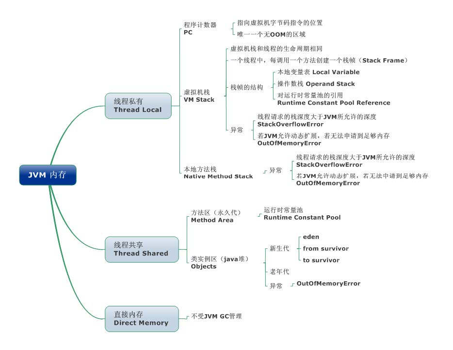
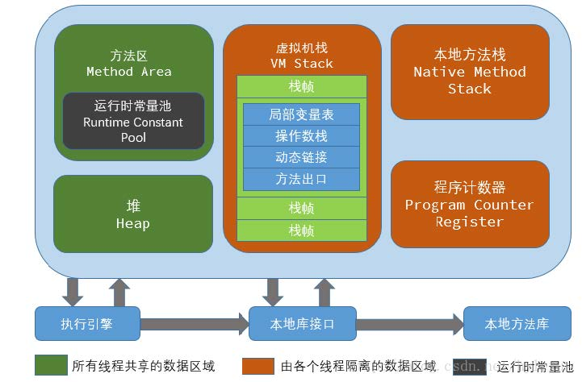
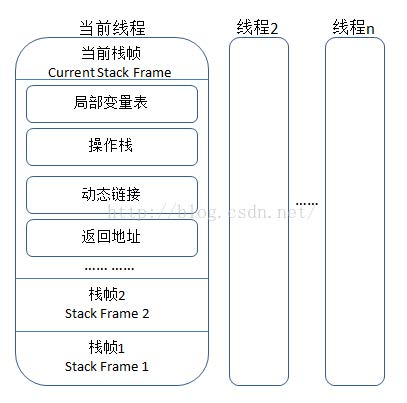

# Java 内存区域

## 一 内存区域概述

Java 虚拟机在执行 Java 程序的过程中会把它管理的内存划分成若干个不同的数据区域。



**线程私有的：**

- 程序计数器
- 虚拟机栈
- 本地方法栈

**线程共享的：**

- 堆（Java堆）

- 方法区

- 直接内存 (非运行时数据区的一部分)

  

  

  

## 二 运行时数据区域
### 2.1 程序计数器（线程私有）
程序计数器是一块较小的内存空间，可以看作是**当前线程所执行的字节码的行号指示器**（字节码解释器工作时通过改变这个计数器的值来选取下一条需要执行的字节码指令，分支、循环、跳转、异常处理、线程恢复等功能都需要依赖这个计数器来完成）。

另外，为了**线程切换后能恢复到正确的执行位置**，**每条线程都需要有一个独立的程序计数器**，各线程之间计数器互不影响，独立存储，我们称这类内存区域为**“线程私有”**的内存。

**从上面的介绍中我们知道程序计数器主要有两个作用：**

1. 字节码解释器通过改变程序计数器来依次读取指令，从而实现代码的流程控制，如：顺序执行、选择、循环、异常处理。
2. 在多线程的情况下，程序计数器用于记录当前线程执行的位置，从而当线程被切换回来的时候能够知道该线程上次运行到哪儿了。

**注意：**程序计数器是**唯一一个不会出现 OutOfMemoryError 的内存区域**，它的生命周期随着线程的创建而创建，随着线程的结束而死亡。

### 2.2 Java 虚拟机栈（线程私有）

与程序计数器一样，Java 虚拟机栈也是**线程私有**的，它的生命周期和线程相同，描述的是 Java 方法执行的内存模型，每次方法调用的数据都是通过栈传递的。

实际上，Java 虚拟机栈是由一个个**栈帧**（Stack Frame）组成，而每个栈帧中都拥有：局部变量表、操作数栈、动态链接、方法出口信息。每个方法在执行的同时都会创建一个栈帧，每一个方法从调用直至执行完成的过程，就对应着一个栈帧在虚拟机栈中入栈到出栈的过程。

栈帧是用来存储数据和部分过程结果的数据结构，同时也被用来处理动态链接 (Dynamic Linking)、 方法返回值和异常分派（ Dispatch Exception）。**栈帧随着方法调用而创建，随着方法结束而销毁**——无论方法是正常完成还是异常完成（抛出了在方法内未被捕获的异常）都算作方法结束。




**局部变量表主要存放了编译器可知的各种数据类型**（boolean、byte、char、short、int、float、long、double）、**对象引用**（reference 类型，它不同于对象本身，可能是一个指向对象起始地址的引用指针，也可能是指向一个代表对象的句柄或其他与此对象相关的位置）。

**Java 虚拟机栈会出现两种异常：StackOverFlowError 和 OutOfMemoryError。**

- **StackOverFlowError：** 若 Java 虚拟机栈的内存大小不允许动态扩展，那么当线程请求栈的深度超过当前 Java 虚拟机栈的最大深度的时候，就抛出 StackOverFlowError 异常。
- **OutOfMemoryError：** 若 Java 虚拟机栈的内存大小允许动态扩展，且当线程请求栈时内存用完了，无法再动态扩展了，此时抛出 OutOfMemoryError 异常。

### 2.3 本地方法栈（线程私有）

和虚拟机栈所发挥的作用非常相似，区别是： **虚拟机栈为虚拟机执行 Java 方法 （也就是字节码）服务，而本地方法栈则为虚拟机使用到的 Native 方法服务。** 在 HotSpot 虚拟机中和 Java 虚拟机栈合二为一。

本地方法被执行的时候，在本地方法栈也会创建一个栈帧，用于存放该本地方法的局部变量表、操作数栈、动态链接、出口信息。

方法执行完毕后相应的栈帧也会出栈并释放内存空间，也会出现 StackOverFlowError 和 OutOfMemoryError 两种异常。

### 2.4 堆（线程共享）
是被**线程共享**的一块内存区域，创建的**对象和数组**都保存在Java堆内存中，也是垃圾收集器进行垃圾收集的最重要的内存区域。由于现代VM采用分代收集算法, 因此Java堆从GC的角度还可以细分为: 新生代(Eden区、From Survivor区和To Survivor区)和老年代。

### 2.5 方法区（线程共享）

方法区也被称为**永久代**。

方法区与 Java 堆一样，是各个线程共享的内存区域，它用于**存储已被虚拟机加载的类信息、常量、静态变量、即时编译器编译后的代码等数据**。虽然 Java 虚拟机规范把方法区描述为堆的一个逻辑部分，但是它却有一个别名叫做 **Non-Heap（非堆）**，目的应该是与 Java 堆区分开来。

#### 2.5.1 方法区和永久代的关系

> 《Java 虚拟机规范》只是规定了有方法区这么个概念和它的作用，并没有规定如何去实现它。那么，在不同的 JVM 上方法区的实现肯定是不同的了。  **方法区和永久代的关系很像 Java 中接口和类的关系，类实现了接口，而永久代就是 HotSpot 虚拟机对虚拟机规范中方法区的一种实现方式。** 也就是说，永久代是 HotSpot 的概念，方法区是 Java 虚拟机规范中的定义，是一种规范，而永久代是一种实现，一个是标准一个是实现，其他的虚拟机实现并没有永久带这一说法。

#### 2.5.2 常用参数

JDK 1.8 之前永久代还没被彻底移除的时候通常通过下面这些参数来调节方法区大小

```java
-XX:PermSize=N //方法区 (永久代) 初始大小
-XX:MaxPermSize=N //方法区 (永久代) 最大大小,超过这个值将会抛出 OutOfMemoryError 异常:java.lang.OutOfMemoryError: PermGen
```

相对而言，垃圾收集行为在这个区域是比较少出现的，但并非数据进入方法区后就“永久存在”了。**

JDK 1.8 的时候，方法区（HotSpot 的永久代）被彻底移除了（JDK1.7 就已经开始了），取而代之是元空间，元空间使用的是直接内存。

下面是一些常用参数：

```java
-XX:MetaspaceSize=N //设置 Metaspace 的初始（和最小大小）
-XX:MaxMetaspaceSize=N //设置 Metaspace 的最大大小
```

与永久代很大的不同就是，如果不指定大小的话，随着更多类的创建，虚拟机会耗尽所有可用的系统内存。

#### 2.5.3 为什么要将永久代 (PermGen) 替换为元空间 (MetaSpace) 呢?

整个永久代有一个 JVM 本身设置固定大小上线，无法进行调整，而元空间使用的是直接内存，受本机可用内存的限制，并且永远不会得到 java.lang.OutOfMemoryError。你可以使用 `-XX：MaxMetaspaceSize` 标志设置最大元空间大小，默认值为 unlimited，这意味着它只受系统内存的限制。`-XX：MetaspaceSize` 调整标志定义元空间的初始大小如果未指定此标志，则 Metaspace 将根据运行时的应用程序需求动态地重新调整大小。

当然这只是其中一个原因，还有很多底层的原因，这里就不提了。

### 2.6 运行时常量池

**运行时常量池是方法区的一部分**。Class 文件中除了有类的版本、字段、方法、接口等描述信息外，还有常量池信息（用于存放编译期生成的各种字面量和符号引用）

既然运行时常量池时方法区的一部分，自然受到方法区内存的限制，当常量池无法再申请到内存时会抛出 OutOfMemoryError 异常。

**JDK1.7 及之后版本的 JVM 已经将运行时常量池从方法区中移了出来，在 Java 堆（Heap）中开辟了一块区域存放运行时常量池。** 


### 2.7 直接内存

**直接内存并不是虚拟机运行时数据区的一部分，也不是虚拟机规范中定义的内存区域，但是这部分内存也被频繁地使用。而且也可能导致 OutOfMemoryError 异常出现。**

JDK1.4 中新加入的 **NIO(New Input/Output) 类**，引入了一种基于**通道（Channel）** 与**缓存区（Buffer）** 的 I/O 方式，它可以直接使用 Native 函数库直接分配堆外内存，然后通过一个存储在 Java 堆中的 DirectByteBuffer 对象作为这块内存的引用进行操作。这样就能在一些场景中显著提高性能，因为**避免了在 Java 堆和 Native 堆之间来回复制数据**。

本机直接内存的分配不会收到 Java 堆的限制，但是，既然是内存就会受到本机总内存大小以及处理器寻址空间的限制。

