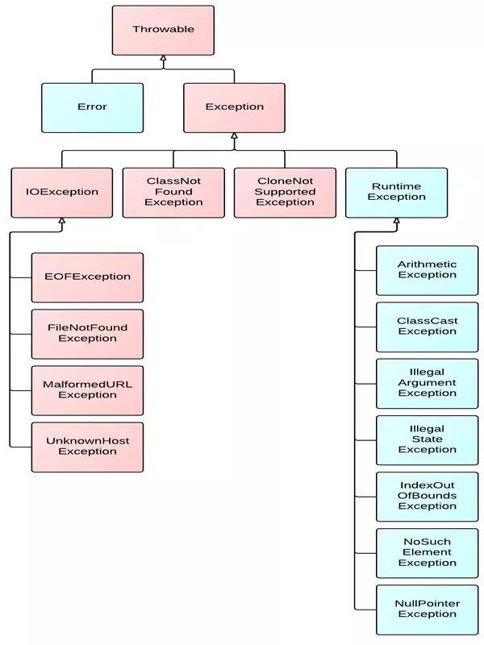

## Java异常处理

### Java异常分类

#### 1）异常架构

​	Throwable为基类，Error和Exception继承Throwable，RuntimeException和IOException等继承Exception。

​	Error和RuntimeException及其子类成为未检查异常（unchecked），其它异常成为已检查异常（checked）

#### 2）Error

​	Error表示程序在运行期间出现了十分严重、不可恢复的错误，在这种情况下应用程序只能中止运行，例如JAVA 虚拟机出现错误。Error是一种unchecked Exception，编译器不会检查Error是否被处理，在程序中不用捕获Error类型的异常。一般情况下，在程序中也不应该抛出Error类型的异常。

#### 3）RuntimeException

​	Exception异常包括RuntimeException异常和其他非RuntimeException的异常。

​	RuntimeException 是一种unchecked Exception，即表示编译器不会检查程序是否对RuntimeException作了处理，在程序中不必捕获RuntimException类型的异常，也不必在方法体声明抛出RuntimeException类。

​	RuntimeException发生的时候，表示程序中出现了编程错误，所以应该找出错误并修改程序，而不是去捕获RuntimeException。

#### 4）**Checked Exception异常**

​	Checked Exception异常，这也是在编程中使用最多的Exception，所有继承自Exception并且不是RuntimeException的异常都是checked Exception，上图中的IOException和ClassNotFoundException。

​	JAVA 语言规定必须对checked Exception作处理，编译器会对此作检查，要么在方法体中声明抛出checked Exception，要么使用catch语句捕获checked Exception进行处理，不然不能通过编译。

### Java异常处理方式

1、遇到问题不进行具体处理，而是继续抛给调用者 （throw，throws）。

2、抛出异常有三种形式，throw、throws和系统自动抛异常。

3、try catch 捕获异常针对性处理方式。

### throws和throw的区别

#### 位置不同 

throws用在函数上，后面跟的是异常类，可以跟多个；而throw用在函数内，后面跟的是异常对象。 

#### 功能不同

throws用来声明异常，让调用者只知道该功能可能出现的问题，可以给出预先的处理方式；throw抛出具体的问题对象，执行到throw，功能就已经结束了，跳转到调用者，并将具体的问题对象抛给调用者。也就是说throw语句独立存在时，下面不要定义其他语句，因为执行不到。

 throws表示出现异常的一种可能性，并不一定会发生这些异常；throw则是抛出了异常，执行throw则一定抛出了某种异常对象。

两者都是消极处理异常的方式，只是抛出或者可能抛出异常，但是不会由函数去处理异常，真正的处理异常由函数的上层调用处理。